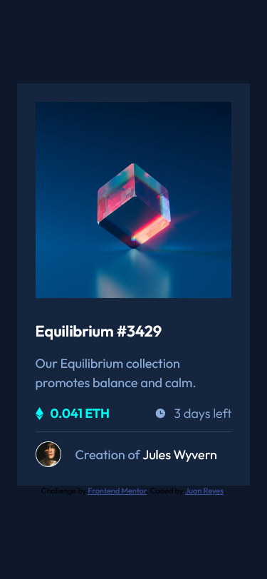
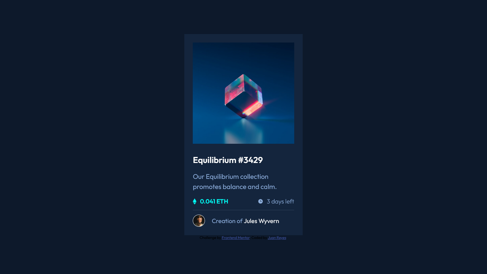

# Frontend Mentor - NFT preview card component

## Deploying your project

As mentioned above, there are many ways to host your project for free. Our recommended hosts are:

- [GitHub Pages](https://pages.github.com/)
- [Vercel](https://vercel.com/)
- [Netlify](https://www.netlify.com/)

You can host your site using one of these solutions or any of our other trusted providers. [Read more about our recommended and trusted hosts](https://medium.com/frontend-mentor/frontend-mentor-trusted-hosting-providers-bf000dfebe).

## Got feedback for us?

We love receiving feedback! We're always looking to improve our challenges and our platform. So if you have anything you'd like to mention, please email hi[at]frontendmentor[dot]io.

This challenge is completely free. Please share it with anyone who will find it useful for practice.

# Frontend Mentor - NFT preview card component solution

## Table of contents

- [Overview](#overview)
  - [The challenge](#the-challenge)
  - [Screenshot](#screenshot)
  - [Links](#links)
- [My process](#my-process)
  - [Built with](#built-with)
  - [What I learned](#what-i-learned)
  - [Continued development](#continued-development)
  - [Useful resources](#useful-resources)
- [Author](#author)
- [Acknowledgments](#acknowledgments)

## Overview
- El reto se trata  de una card en el que en su interior tiene una imagen de presentación. Un título principal y  algo de texto.

- Además tiene unos iconos que dulcifican el diseño y por último hay una línea que separa la foto de perfil y el autor del nft.

### The challenge

- En esta ocasión vemos que el diseño responsivo es prácticamente el mismo para escritorio, que para móvil. 

- Hay elementos que interactuan con el usuario, como cuando le pasas el ratón, sobre la imagen y sobre el título o el nombre del autor.

- He incluido una pequeña transición para que no sea tan brusca la aparición, del icono de visualizar y el fondo cyan. 

### Screenshot

### Links

- Solution URL: [solución desafio](https://github.com/juan-mentor/nft-preview-card-component-main.git)
- Live Site URL: [lugar en vivo](https://juan-mentor.github.io/nft-preview-card-component-main/)

## My process
- En este caso, una vez descargado los archivos y tomao las medidas a los elementos HTML del reto. He empezado por los estilos generales, después he ido a los estilos para móvil

- Una vez acabado los estilos de móvil, he seguido con los de ordenador (que apenas era nada) y por último los estilos cuando pasas el ratón sobre la imagen, título y nombre del autor.

### Built with

- Semantic HTML5 markup
- CSS custom properties
- Flexbox
- Mobile-first workflow

### What I learned

- He aprendido que cuando hay varias imágenes, aparece un pequeño espacio entre ellas, creo que es porque el navegador las renderiza como si fueran texto (al igual que dos palabras tienen un espacio, en este caso las dos imágenes lo tienen.).

- No he encontrado más solución que poner a la imagen `display: block`. No me gusta, pero no se hacerlo de otra forma.

### Continued development

- Me gustaría saber más sobre los filtros en Css y sobre las máscaras. Apenas se de estos temas y no le estoy sacando partido.

## Author

- Frontend Mentor - [@juan-mentor](https://www.frontendmentor.io/profile/juan-mentor)